# Functional Area Map

<!-- generated by arch.generators.functional_areas; do not hand-edit -->

Top-level conceptual view of HydraFlow. Each cluster is a **functional area** — a coherent piece of what this machine does, curated in [`docs/arch/functional_areas.yml`](../functional_areas.yml). The loops/ports/modules inside each cluster are auto-joined from the live AST extractors. New loops or ports must be assigned to an area or `tests/architecture/test_functional_area_coverage.py` fails.

```mermaid
flowchart LR
    subgraph caretaking["Caretaking"]
        caretaking_ADRReviewerLoop([ADRReviewerLoop])
        caretaking_CodeGroomingLoop([CodeGroomingLoop])
        caretaking_CostBudgetWatcherLoop([CostBudgetWatcherLoop])
        caretaking_DependabotMergeLoop([DependabotMergeLoop])
        caretaking_DiagnosticLoop([DiagnosticLoop])
        caretaking_EpicMonitorLoop([EpicMonitorLoop])
        caretaking_EpicSweeperLoop([EpicSweeperLoop])
        caretaking_GitHubCacheLoop([GitHubCacheLoop])
        caretaking_HealthMonitorLoop([HealthMonitorLoop])
        caretaking_PRUnstickerLoop([PRUnstickerLoop])
        caretaking_PricingRefreshLoop([PricingRefreshLoop])
        caretaking_RepoWikiLoop([RepoWikiLoop])
        caretaking_ReportIssueLoop([ReportIssueLoop])
        caretaking_RetrospectiveLoop([RetrospectiveLoop])
        caretaking_RunsGCLoop([RunsGCLoop])
        caretaking_SecurityPatchLoop([SecurityPatchLoop])
        caretaking_SentryLoop([SentryLoop])
        caretaking_SkillPromptEvalLoop([SkillPromptEvalLoop])
        caretaking_StagingPromotionLoop([StagingPromotionLoop])
        caretaking_StaleIssueGCLoop([StaleIssueGCLoop])
        caretaking_StaleIssueLoop([StaleIssueLoop])
        caretaking_TermProposerLoop([TermProposerLoop])
        caretaking_WikiRotDetectorLoop([WikiRotDetectorLoop])
        caretaking_WorkspaceGCLoop([WorkspaceGCLoop])
    end
    subgraph quality_gates["Quality Gates"]
        quality_gates_CIMonitorLoop([CIMonitorLoop])
    end
    subgraph trust_fleet["Trust Fleet"]
        trust_fleet_ContractRefreshLoop([ContractRefreshLoop])
        trust_fleet_CorpusLearningLoop([CorpusLearningLoop])
        trust_fleet_FakeCoverageAuditorLoop([FakeCoverageAuditorLoop])
        trust_fleet_FlakeTrackerLoop([FlakeTrackerLoop])
        trust_fleet_PrinciplesAuditLoop([PrinciplesAuditLoop])
        trust_fleet_RCBudgetLoop([RCBudgetLoop])
        trust_fleet_StagingBisectLoop([StagingBisectLoop])
        trust_fleet_TrustFleetSanityLoop([TrustFleetSanityLoop])
    end
    subgraph hexagonal_boundaries["Hexagonal Boundaries"]
        hexagonal_boundaries_AgentPort[/AgentPort/]
        hexagonal_boundaries_BotPRPort[/BotPRPort/]
        hexagonal_boundaries_IssueFetcherPort[/IssueFetcherPort/]
        hexagonal_boundaries_IssueStorePort[/IssueStorePort/]
        hexagonal_boundaries_ObservabilityPort[/ObservabilityPort/]
        hexagonal_boundaries_PRPort[/PRPort/]
        hexagonal_boundaries_ReviewInsightStorePort[/ReviewInsightStorePort/]
        hexagonal_boundaries_RouteBackCounterPort[/RouteBackCounterPort/]
        hexagonal_boundaries_WorkspacePort[/WorkspacePort/]
    end
    subgraph state_persistence["State & Persistence"]
    end
    subgraph test_harness["Test Harness (MockWorld)"]
    end
    subgraph arch_knowledge["Architecture Knowledge"]
        arch_knowledge_DiagramLoop([DiagramLoop])
    end
    subgraph dashboard["Dashboard"]
    end
    subgraph auto_agent["Auto-Agent (HITL Pre-Flight)"]
        auto_agent_AutoAgentPreflightLoop([AutoAgentPreflightLoop])
        auto_agent_SandboxFailureFixerLoop([SandboxFailureFixerLoop])
    end
    subgraph goal_driven_dev["Goal-Driven Development"]
    end
    subgraph orchestration["Orchestration"]
    end
    classDef unknown stroke:#c00,stroke-width:2px,stroke-dasharray:4 2;
```

## Caretaking

Autonomous background loops that maintain the system without human input — wiki freshness, stale-issue GC, ADR review, retrospective digestion, security patching, dependabot merging, code grooming. Per ADR-0029 (caretaker pattern) and ADR-0049 (kill-switch).

**Loops**

- `ADRReviewerLoop` — `src.adr_reviewer_loop`
- `CodeGroomingLoop` — `src.code_grooming_loop`
- `CostBudgetWatcherLoop` — `src.cost_budget_watcher_loop`
- `DependabotMergeLoop` — `src.dependabot_merge_loop`
- `DiagnosticLoop` — `src.diagnostic_loop`
- `EpicMonitorLoop` — `src.epic_monitor_loop`
- `EpicSweeperLoop` — `src.epic_sweeper_loop`
- `GitHubCacheLoop` — `src.github_cache_loop`
- `HealthMonitorLoop` — `src.health_monitor_loop`
- `PRUnstickerLoop` — `src.pr_unsticker_loop`
- `PricingRefreshLoop` — `src.pricing_refresh_loop`
- `RepoWikiLoop` — `src.repo_wiki_loop`
- `ReportIssueLoop` — `src.report_issue_loop`
- `RetrospectiveLoop` — `src.retrospective_loop`
- `RunsGCLoop` — `src.runs_gc_loop`
- `SecurityPatchLoop` — `src.security_patch_loop`
- `SentryLoop` — `src.sentry_loop`
- `SkillPromptEvalLoop` — `src.skill_prompt_eval_loop`
- `StagingPromotionLoop` — `src.staging_promotion_loop`
- `StaleIssueGCLoop` — `src.stale_issue_gc_loop`
- `StaleIssueLoop` — `src.stale_issue_loop`
- `TermProposerLoop` — `src.term_proposer_loop`
- `WikiRotDetectorLoop` — `src.wiki_rot_detector_loop`
- `WorkspaceGCLoop` — `src.workspace_gc_loop`

**Related ADRs:** `ADR-0029`, `ADR-0049`

## Quality Gates

Runtime CI/test monitoring loops that catch regressions and watch external check status. Distinct from the implement-time skill chain (DiffSanity / ScopeCheck / PlanCompliance / TestAdequacy) which are call-sites, not loops.

**Loops**

- `CIMonitorLoop` — `src.ci_monitor_loop`

**Related ADRs:** `ADR-0023`, `ADR-0035`, `ADR-0044`

## Trust Fleet

The trust-architecture hardening fleet (ADR-0045) — RC promotion gate, staging-bisect attribution, contract refresh, principles audit, flake tracker, corpus learning, fake coverage auditor, RC budget, meta-observability sanity.

**Loops**

- `ContractRefreshLoop` — `src.contract_refresh_loop`
- `CorpusLearningLoop` — `src.corpus_learning_loop`
- `FakeCoverageAuditorLoop` — `src.fake_coverage_auditor_loop`
- `FlakeTrackerLoop` — `src.flake_tracker_loop`
- `PrinciplesAuditLoop` — `src.principles_audit_loop`
- `RCBudgetLoop` — `src.rc_budget_loop`
- `StagingBisectLoop` — `src.staging_bisect_loop`
- `TrustFleetSanityLoop` — `src.trust_fleet_sanity_loop`

**Related ADRs:** `ADR-0042`, `ADR-0045`, `ADR-0048`

## Hexagonal Boundaries

The Port/Adapter seam between domain runtime and the outside world (GitHub, git, the LLM, the filesystem, observability). Each Port has at least one concrete adapter and (per ADR-0047) a fake under tests/scenarios/fakes/.

**Ports**

- `AgentPort` — `src.ports`
- `BotPRPort` — `src.term_proposer_loop`
- `IssueFetcherPort` — `src.ports`
- `IssueStorePort` — `src.ports`
- `ObservabilityPort` — `src.ports`
- `PRPort` — `src.ports`
- `ReviewInsightStorePort` — `src.ports`
- `RouteBackCounterPort` — `src.route_back`
- `WorkspacePort` — `src.ports`

**Related ADRs:** `ADR-0006`, `ADR-0010`, `ADR-0047`

## State & Persistence

Crash-recovery state (StateTracker), event bus, session logs, and the on-disk layout that keeps the pipeline resumable across crashes and restarts.

**Module globs**

- `src/state/**`
- `src/events.py`
- `src/session_log.py`

**Related ADRs:** `ADR-0021`, `ADR-0028`

## Test Harness (MockWorld)

The scenario-ring test harness — `MockWorld` aggregates 14 fakes that emulate every external dependency and integration target. Per ADR-0022 (MockWorld) and ADR-0047 (fake-adapter contract testing).

**Module globs**

- `tests/scenarios/fakes/**`
- `tests/scenarios/builders/**`

**Related ADRs:** `ADR-0022`, `ADR-0047`

## Architecture Knowledge

The self-documenting layer — runner, AST extractors, generators, DiagramLoop (Plan C), CI guard, and Pages site that publishes live architectural truth alongside ADRs and the wiki.

**Loops**

- `DiagramLoop` — `src.diagram_loop`

**Module globs**

- `src/arch/**`

**Related ADRs:** `ADR-0029`, `ADR-0032`

## Dashboard

The operator-facing FastAPI + React dashboard for observing the fleet and overriding routing decisions.

**Module globs**

- `src/ui/**`
- `src/dashboard*.py`
- `src/dashboard_routes/**`
- `src/routes/**`

**Related ADRs:** `ADR-0007`, `ADR-0008`, `ADR-0009`, `ADR-0030`

## Auto-Agent (HITL Pre-Flight)

The Auto-Agent HITL pre-flight loop intercepts every `hitl-escalation` issue before a human sees it, spawns a Claude Code subprocess with a sub-label-routed "lead engineer" persona prompt, and either auto-resolves or hands off with full context. Per ADR-0050.

**Loops**

- `AutoAgentPreflightLoop` — `src.auto_agent_preflight_loop`
- `SandboxFailureFixerLoop` — `src.sandbox_failure_fixer_loop`

**Module globs**

- `src/auto_agent_preflight_loop.py`
- `src/preflight/**`

**Related ADRs:** `ADR-0050`

## Goal-Driven Development

The Discover → Shape → Implement track for vague work that the orchestrator can't take directly. Implemented as call-sites in shape_phase.py and discover_phase.py rather than dedicated loops.

**Module globs**

- `src/discover_phase.py`
- `src/shape_phase.py`

**Related ADRs:** `ADR-0031`

## Orchestration

The plan→implement→review pipeline driving each issue from hydraflow-ready through merge. The original five-loop system per ADR-0001 (now amended); RunLoop and friends live as call-sites within orchestrator.py rather than as separate BaseBackgroundLoop subclasses.

**Module globs**

- `src/orchestrator.py`
- `src/agent.py`
- `src/agent_runner.py`
- `src/planner.py`
- `src/reviewer.py`
- `src/triage_phase.py`
- `src/plan_phase.py`
- `src/implement_phase.py`
- `src/review_phase.py`
- `src/hitl_phase.py`

**Related ADRs:** `ADR-0001`, `ADR-0004`, `ADR-0011`, `ADR-0012`, `ADR-0029`

_Regenerated from commit `4018547` on 2026-05-06 22:41 UTC. Source last changed at `4018547`. Status: 🟢 fresh._
