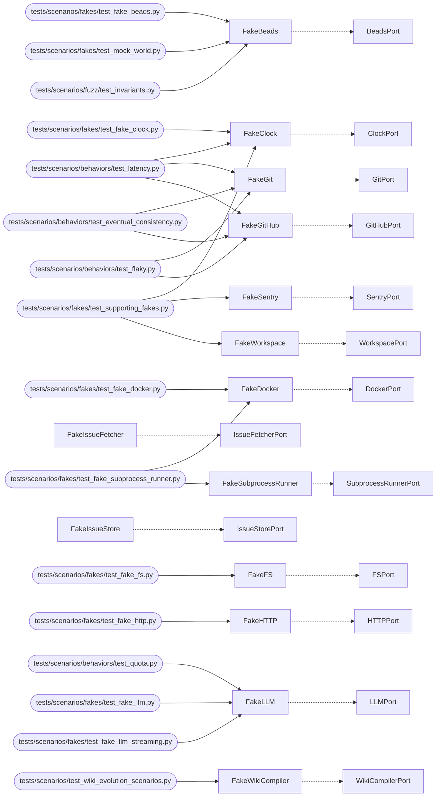

# MockWorld Map

<!-- generated by arch.generators.mockworld_map; do not hand-edit -->

All Fake adapters under `src/mockworld/fakes/` (classes with ``_is_fake_adapter = True``; nested-record dataclasses are filtered out), the `*Port` each implements (by name match), and the scenarios that wire them. Per ADR-0022 (MockWorld) and ADR-0047 (fake-adapter contract testing).

## Fakes

| Fake | Implements | Used in scenarios |
|---|---|---|
| **FakeBeads** | `BeadsPort` | `tests/scenarios/fakes/test_fake_beads.py` `tests/scenarios/fakes/test_mock_world.py` `tests/scenarios/fuzz/test_invariants.py` `tests/scenarios/test_bead_workflow.py` |
| **FakeClock** | `ClockPort` | `tests/scenarios/behaviors/test_latency.py` `tests/scenarios/fakes/test_fake_clock.py` `tests/scenarios/fakes/test_supporting_fakes.py` `tests/scenarios/test_fidelity.py` |
| **FakeDocker** | `DockerPort` | `tests/scenarios/fakes/test_fake_docker.py` `tests/scenarios/fakes/test_fake_subprocess_runner.py` |
| **FakeFS** | `FSPort` | `tests/scenarios/fakes/test_fake_fs.py` |
| **FakeGit** | `GitPort` | `tests/scenarios/behaviors/test_eventual_consistency.py` `tests/scenarios/behaviors/test_flaky.py` `tests/scenarios/behaviors/test_latency.py` `tests/scenarios/behaviors/test_rate_limit.py` `tests/scenarios/browser/scenarios/test_loops_browser.py` `tests/scenarios/fakes/test_fake_git.py` `tests/scenarios/fakes/test_fake_github.py` `tests/scenarios/fakes/test_mock_world.py` `tests/scenarios/fuzz/test_invariants.py` `tests/scenarios/test_fidelity.py` `tests/scenarios/test_loops.py` |
| **FakeGitHub** | `GitHubPort` | `tests/scenarios/behaviors/test_eventual_consistency.py` `tests/scenarios/behaviors/test_flaky.py` `tests/scenarios/behaviors/test_latency.py` `tests/scenarios/behaviors/test_rate_limit.py` `tests/scenarios/browser/scenarios/test_loops_browser.py` `tests/scenarios/fakes/test_fake_github.py` `tests/scenarios/fakes/test_mock_world.py` `tests/scenarios/fuzz/test_invariants.py` `tests/scenarios/test_fidelity.py` `tests/scenarios/test_loops.py` |
| **FakeHTTP** | `HTTPPort` | `tests/scenarios/fakes/test_fake_http.py` |
| **FakeIssueFetcher** | `IssueFetcherPort` | — |
| **FakeIssueStore** | `IssueStorePort` | — |
| **FakeLLM** | `LLMPort` | `tests/scenarios/behaviors/test_quota.py` `tests/scenarios/fakes/test_fake_llm.py` `tests/scenarios/fakes/test_fake_llm_streaming.py` `tests/scenarios/fakes/test_prior_failure_propagation.py` `tests/scenarios/test_fidelity.py` |
| **FakeSentry** | `SentryPort` | `tests/scenarios/fakes/test_supporting_fakes.py` |
| **FakeSubprocessRunner** | `SubprocessRunnerPort` | `tests/scenarios/fakes/test_fake_subprocess_runner.py` |
| **FakeWikiCompiler** | `WikiCompilerPort` | `tests/scenarios/test_wiki_evolution_scenarios.py` |
| **FakeWorkspace** | `WorkspacePort` | `tests/scenarios/fakes/test_supporting_fakes.py` |

## Wiring

_Regenerated from commit `c681459` on 2026-05-07 07:54 UTC. Source last changed at `c681459`. Status: 🟢 fresh._
