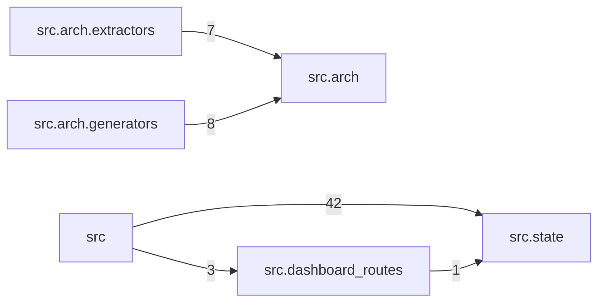

# Module Graph

<!-- generated by arch.generators.module_graph; do not hand-edit -->

Package-level import graph for `src/`. Edge weight = number of import statements aggregated across files.

_Regenerated from commit `64a3095` on 2026-04-25 22:49 UTC. Source last changed at `64a3095`._
