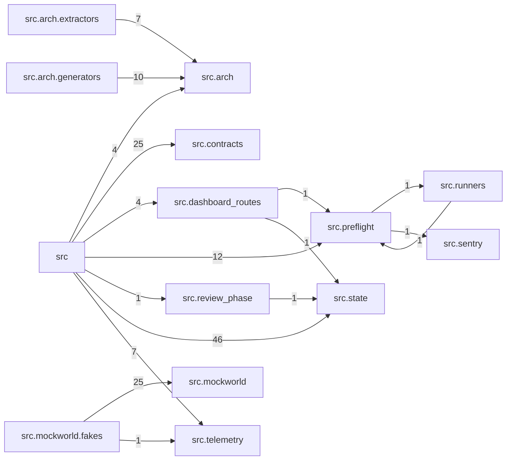

# Module Graph

<!-- generated by arch.generators.module_graph; do not hand-edit -->

Package-level import graph for `src/`. Edge weight = number of import statements aggregated across files.

_Regenerated from commit `50817aa` on 2026-05-18 18:46 UTC. Source last changed at `50817aa`. Status: 🟢 fresh._
