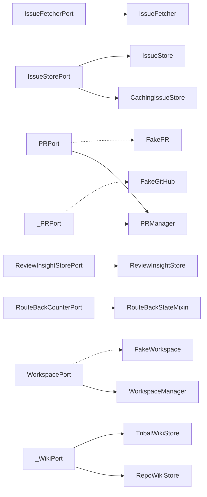

# Port Map

<!-- generated by arch.generators.port_map; do not hand-edit -->

Hexagonal boundaries. Each `*Port` Protocol with its concrete adapter(s) and fake (per ADR-0047). Ports without a fake are flagged ⚠️ — fakes are required for scenario testing.

## Details

### AgentPort

- Module: `src.ports`
- Methods: `_build_command`, `_execute`, `_verify_result`
- Adapters: —
- Fake: ⚠️ no fake (every Port needs a fake per ADR-0047)

### IssueFetcherPort

- Module: `src.ports`
- Methods: `fetch_issue_by_number`, `fetch_issues_by_labels`
- Adapters:
  - `IssueFetcher` (`src.issue_fetcher`)
- Fake: ⚠️ no fake (every Port needs a fake per ADR-0047)

### IssueStorePort

- Module: `src.ports`
- Methods: `enqueue_transition`, `enrich_with_comments`, `get_implementable`, `get_plannable`, `get_reviewable`, `get_triageable`, `is_active`, `mark_active`, `mark_complete`, `mark_merged`, `release_in_flight`
- Adapters:
  - `CachingIssueStore` (`src.caching_issue_store`)
  - `IssueStore` (`src.issue_store`)
- Fake: ⚠️ no fake (every Port needs a fake per ADR-0047)

### ObservabilityPort

- Module: `src.ports`
- Methods: `breadcrumb`, `capture_exception`, `flush`
- Adapters: —
- Fake: ⚠️ no fake (every Port needs a fake per ADR-0047)

### PRPort

- Module: `src.ports`
- Methods: `add_labels`, `branch_has_diff_from_main`, `close_issue`, `close_task`, `create_issue`, `create_pr`, `create_promotion_pr`, `create_rc_branch`, `create_task`, `delete_branch`, `expected_pr_title`, `fetch_ci_failure_logs`, `fetch_code_scanning_alerts`, `find_existing_issue`, `find_open_pr_for_branch`, `find_open_promotion_pr`, `get_dependabot_alerts`, `get_issue_state`, `get_issue_updated_at`, `get_latest_ci_status`, `get_pr_approvers`, `get_pr_diff`, `get_pr_diff_names`, `get_pr_head_sha`, `get_pr_mergeable`, `list_closed_issues_by_label`, `list_hitl_items`, `list_issue_comments`, `list_issues_by_label`, `list_rc_branches`, `merge_pr`, `merge_promotion_pr`, `post_comment`, `post_pr_comment`, `pull_main`, `push_branch`, `remove_label`, `submit_review`, `swap_pipeline_labels`, `transition`, `update_issue_body`, `update_pr_title`, `upload_screenshot`, `wait_for_ci`
- Adapters:
  - `PRManager` (`src.pr_manager`)
- Fake: `FakePR` (`tests.scenarios.fakes.fake_github`)

### ReviewInsightStorePort

- Module: `src.ports`
- Methods: `append_review`, `get_proposed_categories`, `load_proposal_metadata`, `load_recent`, `mark_category_proposed`, `record_proposal`, `update_proposal_verified`
- Adapters:
  - `ReviewInsightStore` (`src.review_insights`)
- Fake: ⚠️ no fake (every Port needs a fake per ADR-0047)

### RouteBackCounterPort

- Module: `src.route_back`
- Methods: `decrement_route_back_count`, `get_route_back_count`, `increment_route_back_count`
- Adapters:
  - `RouteBackStateMixin` (`src.state._route_back`)
- Fake: ⚠️ no fake (every Port needs a fake per ADR-0047)

### WorkspacePort

- Module: `src.ports`
- Methods: `abort_merge`, `create`, `destroy`, `destroy_all`, `get_conflicting_files`, `merge_main`, `post_work_cleanup`, `reset_to_main`, `start_merge_main`
- Adapters:
  - `WorkspaceManager` (`src.workspace`)
- Fake: `FakeWorkspace` (`tests.scenarios.fakes.fake_workspace`)

### _PRPort

- Module: `src.preflight.context`
- Methods: `get_issue`, `list_issue_comments`
- Adapters: —
- Fake: ⚠️ no fake (every Port needs a fake per ADR-0047)

### _PRPort

- Module: `src.preflight.decision`
- Methods: `add_labels`, `post_comment`, `remove_label`
- Adapters:
  - `PRManager` (`src.pr_manager`)
- Fake: `FakeGitHub` (`tests.scenarios.fakes.fake_github`)

### _WikiPort

- Module: `src.preflight.context`
- Methods: `query`
- Adapters:
  - `RepoWikiStore` (`src.repo_wiki`)
  - `TribalWikiStore` (`src.tribal_wiki`)
- Fake: ⚠️ no fake (every Port needs a fake per ADR-0047)

_Regenerated from commit `658d325` on 2026-04-26 04:02 UTC. Source last changed at `658d325`. Status: 🟢 fresh._
